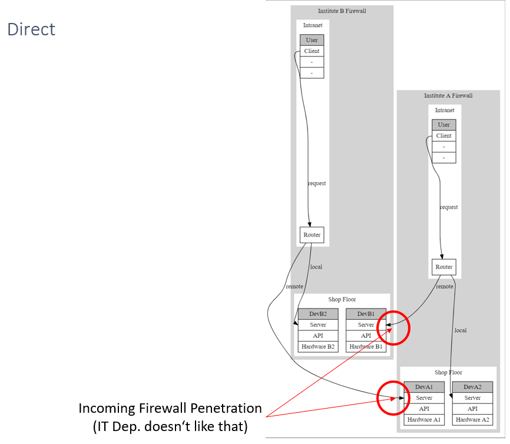

# Public OPC UA Mirror Demo

Demo code how to share data from a local OPC UA server to the public without allowing incomming connections in the firewall by using an internal and an external mirror server

# Quick start guide

1. Install Python, e. g. portable WinPython: https://sourceforge.net/projects/winpython/
2. Optional: Install Git https://git-scm.com/download/win and clone this repo
3. Open a Python-Console and run `pip install asyncua` and `pip3 install opcua-client`
4. Open an IDE, e. g. Spyder and select run configuration 'run in external system terminal'
5. Open 'public-opc-ua-mirror-demo.py' or copy-paste the file content in a new script file and run it
6. Open a Python-Console and run opcua-client, e.g. `..\python-3.8.7.amd64\Scripts\opcua-client.exe` to start one GUI client (1)
7. Open a Python-Console and run opcua-client, e.g. `..\python-3.8.7.amd64\Scripts\opcua-client.exe` to start another GUI client (2)
8. Connect client (1) to `opc.tcp://0.0.0.0:4840/` (Physical Device) and client (2) to `opc.tcp://0.0.0.0:4841/` (Virtual Device)
9. You can now read and write variables in client (2) and track the changes on the physical device with client (1)

# Background

The simplest solution to share data with external institutions is to open the ports of the associated servers in the firewall for incoming connections. However, this poses a significant security risk, as it is very costly to intercept all unauthorized access behind the open firewall.

It is therefore better if the institutions connect to a shared, public server where only the relevant data is stored. While security is served by this, there is an additional effort for developers, since external data is accessed via a different protocol (e.g. SQL, Websockets, etc.) than internal device data (e.g. REST, OPC UA, etc.).

To compensate for this disadvantage as well, virtual OPC UA devices can be made available on a public server of the respective other institution, as demonstrated in this project. These virtual devices behave exactly like the real devices, except that no real hardware is present. Instead, incoming and outgoing data is synchronized between the virtual and the real device via internal and authorized synchronization servers.

